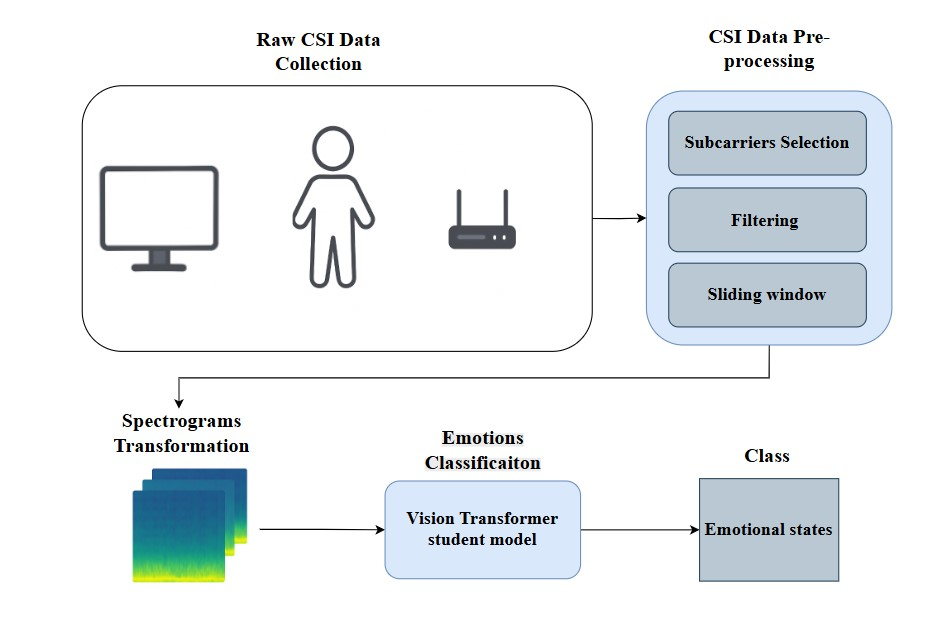
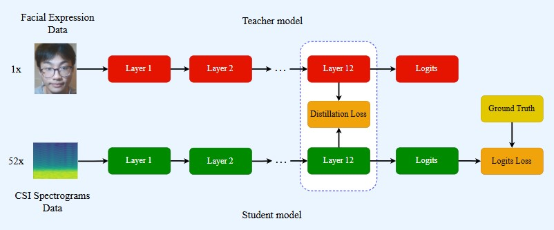

# emotion-recognition-using-csi

This project uses WiFi Channel State Information (CSI) to recognize emotions by analyzing breathing patterns. The method is non-invasive and preserves privacy because it does not rely on cameras or wearable devices. A Vision Transformer (ViT) trained on facial expressions is used to transfer knowledge to a CSI-based model, improving emotion classification from CSI spectrogram data.
## Demo

[](https://youtu.be/IGxeG4zzgJk)

---

## Table of Contents

1. [Overview](#overview)
2. [System Design](#system-design)
3. [Model Architecture & Training](#model-architecture--training)
4. [Tech Stack](#tech-stack)
5. [Dataset Structure](#dataset-structure)
6. [Quick Start](#quick-start)
   - [1. Install Dependencies](#1-install-dependencies)
   - [2. Prepare Dataset](#2-prepare-dataset)
   - [3. Train Model](#3-train-model)
   - [4. Evaluate Model](#4-evaluate-model)
   - [5. Predict on New Data](#5-predict-on-new-data)
7. [Key Features](#key-features)
8. [Configuration](#configuration)
9. [Workflow](#workflow)

---

## Overview

This project uses knowledge distillation to transfer emotion recognition capabilities from video to WiFi signals:

- **Teacher Model**: Vision Transformer trained on facial expressions
- **Student Model**: Vision Transformer adapted for CSI spectrograms
- **Emotions**: Happy, Sad, Neutral, Angry

---

## System Design

The diagram below illustrates the end-to-end system architecture, from data collection through to real-time emotion inference.



---

## Model Architecture & Training

The training pipeline uses knowledge distillation, where a pre-trained ViT teacher (trained on facial expression images) supervises a student ViT model that operates on CSI spectrograms.



### Teacher Model
- Input: RGB images (3 channels, 224×224)
- Architecture: Vision Transformer
- Output: 4 emotion classes

### Student Model
- Input: CSI spectrograms (52 channels, 224×224)
- Architecture: Vision Transformer (weights initialized from teacher)
- Output: 4 emotion classes + hidden states

### Loss Function

```
Total Loss = Cross-Entropy Loss + 0.001 × Feature MSE Loss
```

---

## Tech Stack

### Frameworks & Libraries

- **PyTorch** - Deep learning framework
- **Transformers** (Hugging Face) - Vision Transformer models
- **facenet-pytorch** - Face detection (MTCNN)
- **OpenCV** - Video processing
- **SciPy** - Signal processing (spectrograms)
- **scikit-learn** - Evaluation metrics
- **Pandas & NumPy** - Data manipulation
- **Matplotlib & Seaborn** - Visualization
- **argparse** - Command-line interface (used in `main.py`)

### Models

- **Teacher**: `dima806/facial_emotions_image_detection` (pre-trained ViT)
- **Student**: Custom ViT (52 channels for CSI, 4 output classes)

### Key Techniques

- Knowledge Distillation (logit + feature-based)
- Spectrogram generation from CSI data
- Face detection and cropping
- Mixed precision training

---

## Dataset Structure

```
Emotions dataset/
├── Happy/
│   ├── teacher_data_happy/      # MP4 videos
│   └── student_data_happy/      # CSV CSI files
├── Sad/
├── Neutral/
└── Angry/
```

The emotion recognition dataset is large (9.25 GB) and stored externally.

You can download it here:  
[Emotions dataset - Google Drive](https://drive.google.com/drive/folders/11euByOm9QnQgdzX6C3e-TukrJBf4qAIS)

---

## Quick Start

### 1. Install Dependencies

```bash
pip install -r requirements.txt
```

### 2. Prepare Dataset

Process raw emotion data and create train/val/test splits:

```bash
python main.py prepare --data-dir "./Emotions dataset" --output-dir ./processing_data/my_video_csi_dataset
```

**Options:**

| Flag | Description | Default |
|------|-------------|---------|
| `--data-dir` | Path to raw emotions dataset | required |
| `--output-dir` | Output directory for processed datasets | `./my_video_csi_dataset` |
| `--segment-length` | CSI segment length | `600` |
| `--step-size` | Step size for segmentation | `400` |
| `--train-split` | Training set ratio | `0.8` |
| `--val-split` | Validation set ratio | `0.1` |

### 3. Train Model

Train the student model with knowledge distillation:

```bash
python main.py train --dataset-dir ./processing_data/my_video_csi_dataset --output-dir ./model_weights --epochs 20
```

**Options:**

| Flag | Description | Default |
|------|-------------|---------|
| `--dataset-dir` | Directory containing prepared datasets | required |
| `--output-dir` | Output directory for model checkpoints | `./model_weights` |
| `--epochs` | Number of training epochs | `20` |
| `--batch-size` | Batch size for training | `32` |
| `--lr` | Learning rate | `0.001` |
| `--milestones` | LR scheduler milestones | `10, 80` |
| `--gamma` | Learning rate decay factor | `0.1` |
| `--resume` | Path to checkpoint to resume training | optional |

### 4. Evaluate Model

Evaluate model performance on test/validation datasets:

```bash
python main.py test --model-path ./model_weights/model_epoch_15 --dataset-dir ./processing_data/my_video_csi_dataset
```

**Options:**

| Flag | Description | Default |
|------|-------------|---------|
| `--model-path` | Path to trained model weights | required |
| `--dataset-dir` | Directory containing prepared datasets | required |
| `--dataset-type` | Dataset to evaluate on: `train`, `val`, or `test` | `test` |
| `--batch-size` | Batch size for evaluation | `32` |

### 5. Predict on New Data

Predict emotion from a single CSI file:

```bash
python main.py predict --model-path ./model_weights/model_epoch_15 --csi-file ./sample_data/angry7.csv
```

**Options:**

| Flag | Description | Default |
|------|-------------|---------|
| `--model-path` | Path to trained model weights | required |
| `--csi-file` | Path to CSI CSV file | required |
| `--segment-length` | CSI segment length | `600` |
| `--step-size` | Step size for segmentation | `400` |

---

## Key Features

### Data Processing
- CSI to spectrogram conversion (224×224)
- Face detection and extraction from video
- Synchronized video-CSI pairing
- Train/val/test split (80%/10%/10%)

### Training
- Knowledge distillation loss (cross-entropy + MSE)
- Adam optimizer with MultiStepLR scheduling
- Mixed precision training
- Automatic best model checkpointing

### Evaluation
- Precision, Recall, F1-Score
- Confusion matrix visualization
- Per-segment and aggregated predictions

---

## Configuration

### Data Parameters

| Parameter | Value |
|-----------|-------|
| Segment length | 600 samples |
| Step size | 400 samples |
| Sampling rate | 10 kHz |
| Image size | 224×224 |

### Training Parameters

| Parameter | Description |
|-----------|-------------|
| Batch size |  `--batch-size` |
| Learning rate |  `--lr` |
| Epochs |  `--epochs` |
| LR decay |  `--gamma` |
| Feature loss weight | 0.001 (fixed) |

---

## Workflow

1. **Data Collection** - Synchronized video + CSI recordings
2. **Preprocessing** - Face extraction + CSI spectrogram generation
3. **Training** - Knowledge distillation from teacher to student
4. **Evaluation** - Metrics computation and visualization
5. **Inference** - Real-time emotion prediction from CSI